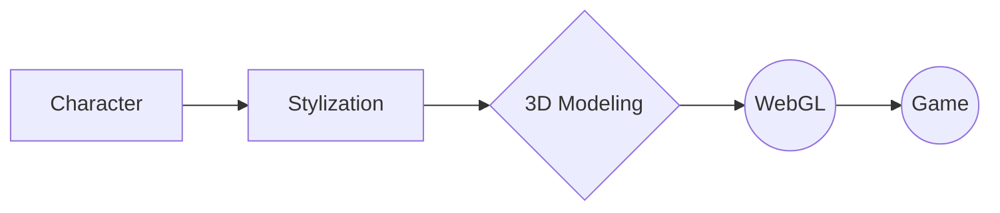

# Generative-Art-Lab  

Generative Art Lab is a collaborative platform dedicated to exploring the intersection of art and artificial intelligence (AI).  
Join us to create, share, and discover AI-generated artworks.

## AI Generation Experiment Pipeline:
Character > Stylization > 3D Modeling > WebGL > Game

